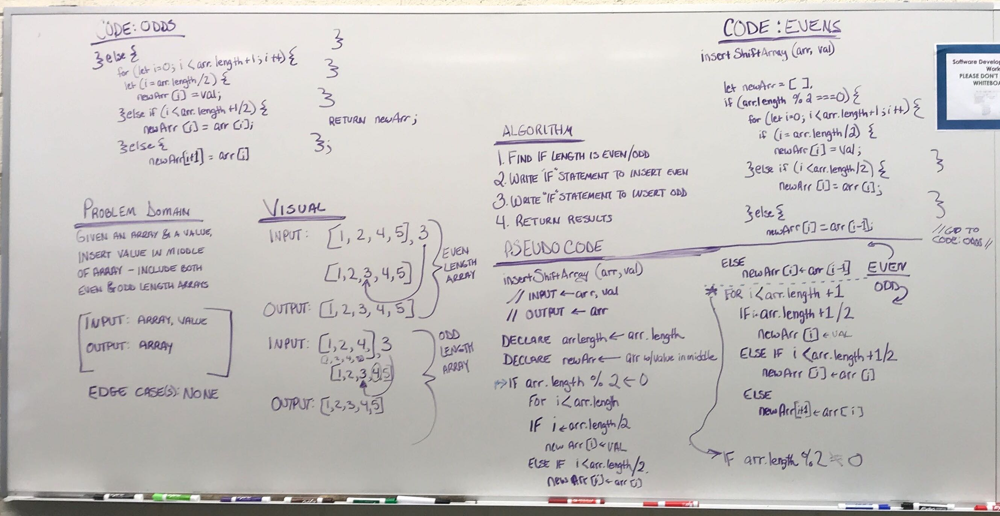

# Shift an Array
This challenge is to develop whiteboard skills and to have a forward/backward understanding of Array.shift. The goal of this challenge is to, without using any Javascript Array Methods (like .shift, .splice, etc.) place a value in the middle of an array.

## Challenge
Write a function called 'insertShiftArray' which takes an array and the value to be added. Without using any of the methods in my known language, return an array with the new value added to the middle of array. Give consideration to odd and even length arrays. Lastly, write tests to verify code.

## Approach & Efficiency
I read through the problem, created my file structure at the terminal line, and then moved to the whiteboard. Photodocumentation of my whiteboard for this challenge is embedded below. I spent about 30 minutes on the whiteboard and _____ minutes coding the solution.

## Solution

